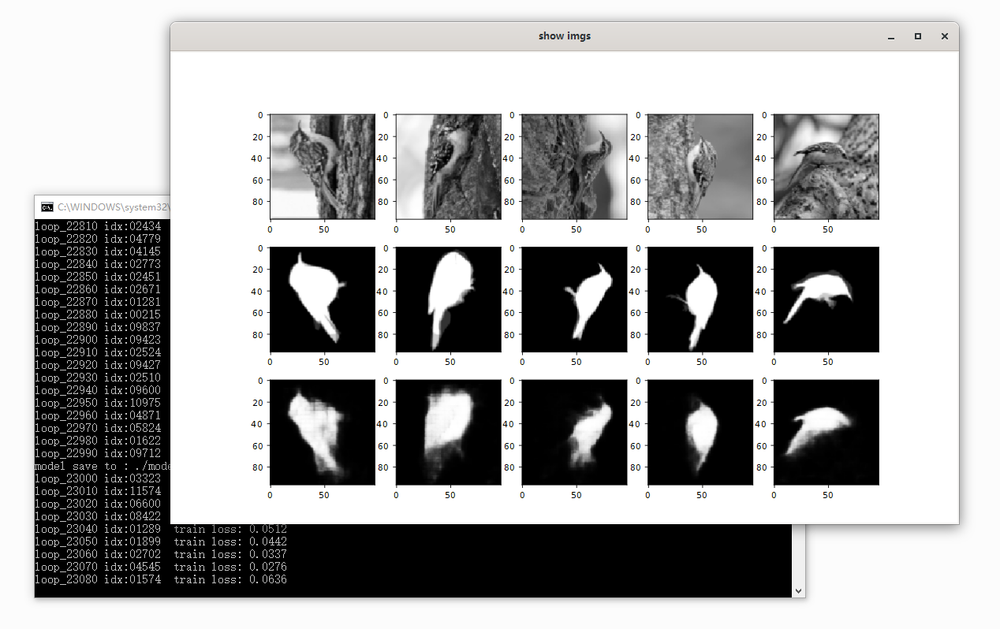

# Image segmentation (The Caltech-UCSD Birds-200-2011 Dataset) 

setup dataset image path:

    edit  gtk_mask_train_quick.py

        class main:
            imgs_dir = "e:/cv_datasets/CUB_200_2011/images"
            imgs_mask_dir = "e:/cv_datasets/CUB_200_2011/segmentations"

training models:

    win10  cmd  console :

        python3   gtk_mask_train_quick.py

